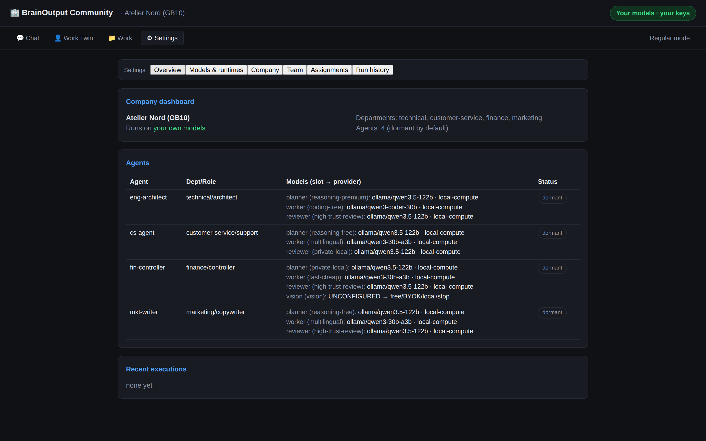

# BrainOutput Community Edition

**Run an entire AI company on your own free / local / BYOK models — with zero BrainOutput‑funded inference.**

A configurable, token‑efficient AI company: durable agent **roles** (departments, capability slots,
approval gates) whose execution context is created **only when there's work**. Every model is your
own, free, or local — and the code **refuses** any BrainOutput‑funded inference.

> The role persists; the execution context is created only when work exists.

[Quick start](#quick-start) · [Full install & examples](CLEAN_INSTALL.md) · [Quickstart](QUICKSTART.md) · [Safety](SAFETY.md)



## Why

- **$0 BrainOutput‑funded inference — enforced in code.** An unassigned capability slot offers
  free / BYOK / local / stop; it **never** falls back to a paid model.
- **Free models first**, your own API key (BYOK), or a **local** model (Ollama or any
  OpenAI‑compatible endpoint) — you always see who pays for each model.
- **Agents dormant by default** — no idle runs, no LLM heartbeats; work happens only for a submitted
  objective.
- **Different models per capability slot and department** — a premium reasoner for planning, a free
  coder for workers, a local model for anything private.
- **Review & approval built in** — an *agent* reviewer validates a worker's output against the
  **policies bound to that work** (loaded by department/tag, not the worker's raw instructions); a
  human is pulled in **only when the reviewer can't clear it**, with a decision-ready brief. Money
  movement and deploys always gate. See **[REVIEW_AND_APPROVAL.md](docs/REVIEW_AND_APPROVAL.md)**.
- **Zero‑dependency Node ESM.** Requires only **Node ≥ 18**.

## Quick start

```bash
git clone https://github.com/brainoutputhq/brainoutput-community.git
cd brainoutput-community
node bo-community.mjs setup      # loads a starter company (agents dormant, $0)
node bo-community.mjs serve      # dashboard → http://127.0.0.1:3100
```

First run with no company launches onboarding automatically. Verify the whole clean‑install path in a
throwaway temp dir (touches nothing of yours):

```bash
npm run smoke:community-clean    # ✓ 12/12 checks · BrainOutput-funded inference: $0
```

See **[CLEAN_INSTALL.md](CLEAN_INSTALL.md)** for local / free / BYOK examples, uninstall, and
troubleshooting.

## Concepts (`ce-core.mjs`)

- **Agent Profile** (durable role): id, department, objectives, instructions, tools, knowledge,
  permissions, approval thresholds, **capability slots** (planner/worker/reviewer), privacy & cost
  policy, activation rules. Deployed **dormant** by default; no idle runs, no LLM heartbeats.
- **Capability Slot** (logical requirement): `reasoning-premium/-free`, `coding-premium/-free`,
  `fast-cheap`, `long-context`, `vision`, `voice`, `embeddings`, `multilingual`, `private-local`,
  `high-trust-review`. Agents reference **slots**, never provider/model names.
- **Model Connection** (`validateConnection`): a user/free/local inference source with a
  `costSource` (free · user-subscription · user-api-account · local-compute) and `funder`
  (free · user · local). A `funder: "brainoutput"` or any BrainOutput‑hosted paid credential is
  **rejected** — it can never be a Community model connection.
- **Model Assignment**: user‑configurable `slot → connection` map (`departments.mjs` gives
  per‑department defaults; you override everything).
- **Execution Graph** (`planGraph`): the **smallest** shape that fits — single · planner-worker ·
  planner-parallel-workers · worker-reviewer · agent-tool · agent-approval-action. No planner for a
  clear task; no reviewer unless risk/policy requires; no CEO unless genuinely strategic.
- **Router** (`routeTask`): department + role + task → agent → smallest graph → least‑cost permitted
  model per node. Throws if any node would use BrainOutput‑funded inference; unassigned slots →
  offer free/BYOK/local/stop, **never** an automatic paid fallback.
- **Free catalog** (`makeCatalog`): refreshable, health‑checked; the free profile picks only
  currently‑available free models — never one hardcoded model.
- **Config preflight** (`validateCompanyConfig`): validates a whole company definition before use
  (the $0 invariant, unknown slots, dangling assignments, duplicate/missing ids).

## Adapters (`adapters.mjs`) — executor‑neutral

`deterministic-workflow` (no model) · `local-openai-compatible` (Ollama/vLLM, local compute) ·
`generic-llm-agent` (OpenAI‑compatible free/BYOK) · `human-approval` (a person authorizes actions) ·
`opencode` (repo work through a hardened sandbox with a user/local coding model). Claude Code /
Codex / Hermes are optional later adapters.

## Commands

```bash
node bo-community.mjs setup      # load the starter company
node bo-community.mjs serve      # web dashboard
node bo-community.mjs onboard    # interactive first-run onboarding (free-model first)
node bo-community.mjs demo       # run the sample workflows on your local models ($0)
npm test                         # node --test *.test.mjs  (zero-dep)
npm run smoke:community-clean    # end-to-end clean-install smoke in a temp dir
```

The demo (`demo/company.json`) is three departments with **different** models — Technical (premium
planner + free/local coding worker), Customer Service (multilingual worker), and Finance
(deterministic reconciliation + human‑approved payment, with the vision slot intentionally
unconfigured to show the no‑paid‑fallback path). Every run reports model / provider / tokens /
**cost source** / artifacts and asserts BrainOutput‑funded tokens = 0.

## Status

**Alpha 0.1.0** — early but real; open source and free to run, self-host, or build on. See
**[SAFETY.md](SAFETY.md)**. Zero external dependencies; the test suite runs with `npm test`.

## License

**[Apache License 2.0](LICENSE)** — a permissive open-source license. You may use, modify, self-host,
and build on this software, including commercially; it includes an explicit patent grant. Attribution
lives in [`NOTICE`](NOTICE). Contributions are accepted under a Developer Certificate of Origin — see
**[CONTRIBUTING.md](CONTRIBUTING.md)**.

> The **Community Edition** is the open-source base. BrainOutput's **hosted** service and **solutions**
> (diagnostic, AI audit, implementation) are built on this same base — you can always run it yourself
> for free.
